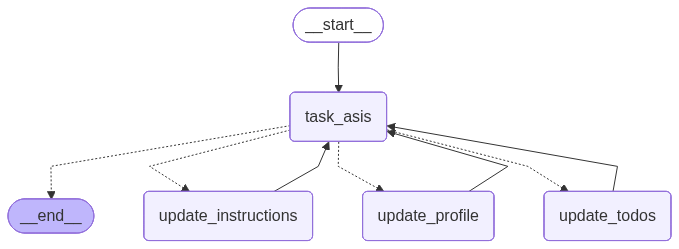

# Memory Agent (MemA)

A sophisticated LangGraph-based memory agent that manages user profiles, ToDo lists, and instructions with long-term memory persistence.



## 🚀 Features

* **Long-term Memory**: Persistent storage for user profiles, ToDo items, and instructions
* **Profile Management**: Tracks user information, connections, and interests
* **ToDo Management**: Creates, updates, and manages task lists with solutions
* **Instruction Learning**: Adapts behavior based on user feedback
* **Production Ready**: Modular architecture with logging, metrics, and health monitoring
* **Comprehensive Testing**: 30 focused unit tests covering all components

## 🏗️ Architecture

```
MemA/
├── main.py                   # Application entry point
├── config.py                 # Configuration management
├── requirements.txt          # Python dependencies
├── .env.example              # Environment variables template
├── .gitignore                # Git ignore rules
├── pytest.ini               # Test configuration
├── graph/                    # Graph components
│   ├── __init__.py
│   ├── state.py              # State definitions (TypedDict)
│   ├── nodes.py              # Graph node functions
│   ├── edges.py              # Conditional edge routers
│   └── builder.py            # Graph construction
├── chains/                   # LLM chain components
│   ├── __init__.py
│   ├── prompts.py            # Prompt templates
│   └── extractors.py         # Data extraction tools
├── schemas/                  # Data validation models
│   ├── __init__.py
│   ├── profile.py            # User profile schema
│   ├── todo.py               # ToDo item schema
│   └── memory.py             # Memory update schema
├── utils/                    # Utility modules
│   ├── __init__.py
│   ├── logging_config.py     # Logging configuration
│   ├── metrics.py            # Performance metrics
│   └── helpers.py            # Helper functions
└── tests/                    # Test suite
    ├── __init__.py
    ├── test_agent.py         # Production tests
    └── test_basic.py         # Unit tests (30 tests)
```

## 🔧 Configuration

Create a `.env` file with the following variables:

```bash
# Required
GOOGLE_API_KEY=your_google_api_key

# Optional - LangSmith Tracing
LANGCHAIN_API_KEY=your_langchain_api_key
LANGCHAIN_TRACING_V2=true
LANGCHAIN_PROJECT=MemA

# Optional - Defaults provided
MODEL_NAME=gemini-2.0-flash-lite
LOG_LEVEL=INFO
LOG_FILE=asis_agent.log
```

## 📦 Installation

```bash
# Create virtual environment
python -m venv .venv

# Activate virtual environment
# Windows:
.venv\Scripts\activate
# Linux/Mac:
source .venv/bin/activate

# Install dependencies
pip install -r requirements.txt
```

## 🚀 Usage

```bash
python main.py
```

The agent will:
1. Load user profile and ToDo list from memory
2. Process user messages and update memory as needed
3. Provide personalized responses based on stored information
4. Learn from user feedback and adapt behavior

## 🧪 Testing

```bash
# Run all tests
pytest tests/ -v

# Run with coverage
pytest tests/ --cov=. --cov-report=html

# Run specific test file
pytest tests/test_basic.py -v
```

## 📊 Graph Visualizations

The system generates PNG visualizations:
- `graph.png` - Complete memory agent workflow

## 🛡️ Error Handling

- Comprehensive logging throughout the workflow
- Graceful handling of API failures
- State management with checkpointing
- Input validation with Pydantic
- Retry logic for transient failures
- Health checks and metrics tracking

## 🔄 Memory Management

The agent maintains three types of memory:
1. **User Profile**: Personal information, connections, interests
2. **ToDo List**: Tasks with solutions, deadlines, and status
3. **Instructions**: Behavioral guidelines learned from user feedback

## 📄 License

MIT

## 🙏 Acknowledgments

- LangGraph for the workflow framework
- LangChain for LLM integration
- Google Gemini for the language model
- Pydantic for data validation
