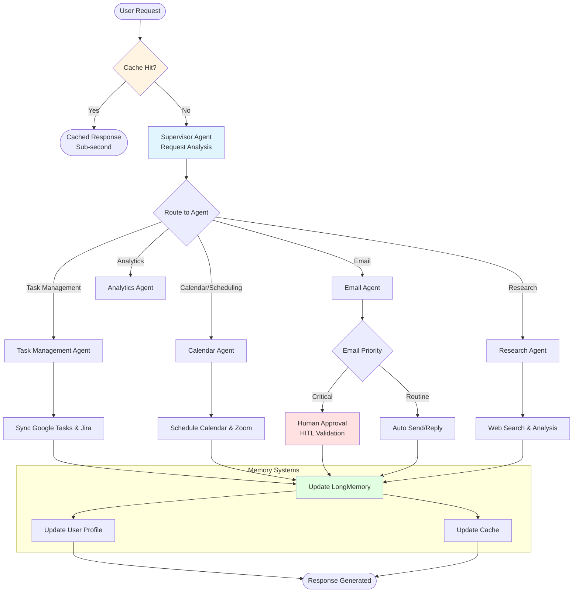
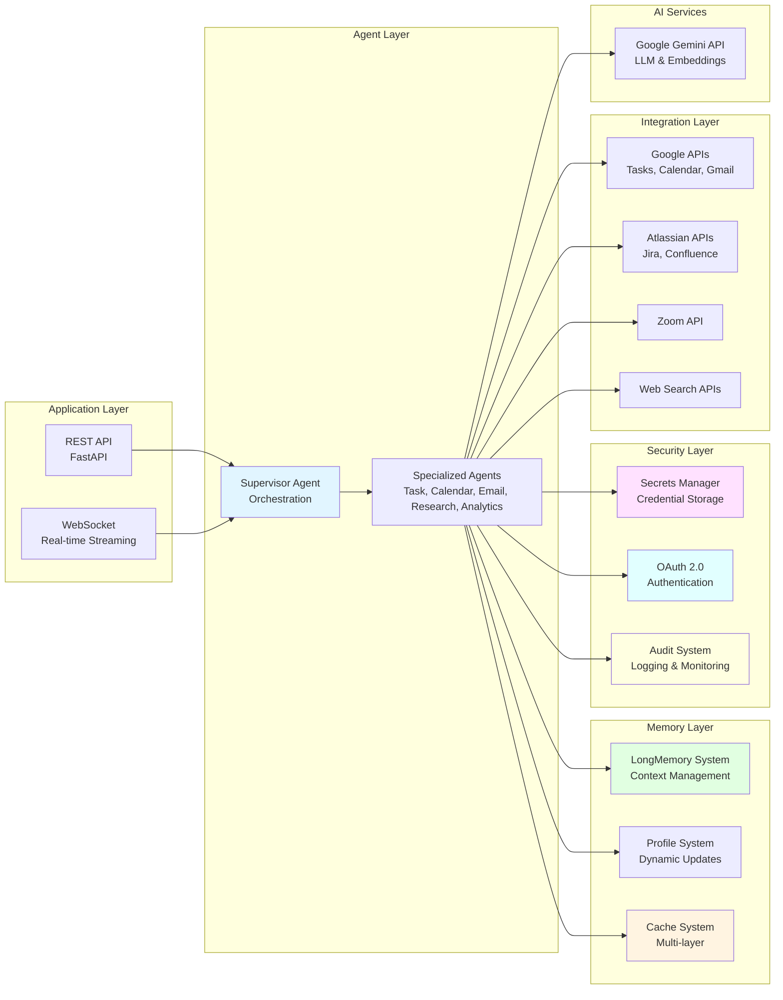
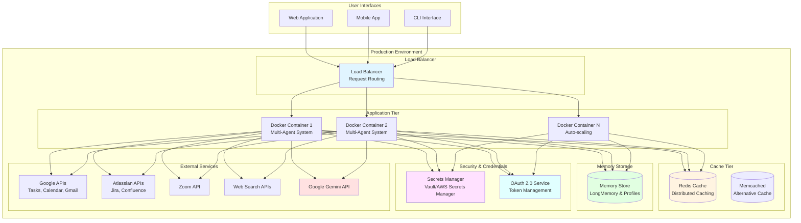

# Multi-Agent Personal Assistant & Time Organizer - Project Description

## Executive Summary

The Multi-Agent Personal Assistant & Time Organizer is a sophisticated personal productivity automation system built on a Multi-Agent Architecture that streamlines personal productivity and professional collaboration through autonomous coordination of tasks and schedules. The system integrates seamlessly with Google Tasks, Jira, Google Calendar, Zoom, Confluence, and Gmail to provide unified task management, automated scheduling, intelligent email triage, and autonomous research capabilities. With advanced caching optimization and comprehensive analytics, the system delivers sub-second response times while reducing operational costs by 40-60% through intelligent API call reduction and LLM token optimization.

---

## The Business Problem

### Challenge Overview

Professionals managing both personal and professional responsibilities face critical productivity challenges that impact efficiency, decision-making speed, and work-life balance:

**Fragmented Task Management**
- Tasks scattered across multiple platforms (Google Tasks for personal, Jira for professional projects)
- Manual synchronization required between personal and professional task lists
- No unified view of priorities and deadlines across platforms
- Time wasted switching between different tools and interfaces

**Scheduling Overhead**
- Manual calendar management and meeting coordination
- Time-consuming back-and-forth email exchanges for scheduling
- Difficulty finding optimal meeting times across multiple participants
- Missed appointments and scheduling conflicts due to manual oversight

**Email Overload**
- Inbox overwhelmed with mixed-priority communications
- Critical emails buried among routine messages
- Time wasted manually sorting and prioritizing emails
- Risk of missing important communications in high-volume inboxes

**Information Access Delays**
- Manual research required for decision-making
- Time-consuming information gathering across multiple sources
- Delayed responses due to research overhead
- Inconsistent information quality from ad-hoc research

**Lack of Productivity Visibility**
- No clear metrics on time saved through automation
- Limited visibility into system performance and ROI
- Difficulty tracking productivity improvements
- No data-driven insights for optimization

### Business Impact

These challenges create significant productivity losses and operational inefficiencies:

- **Time Waste**: Professionals spend 2-3 hours daily on routine coordination tasks that could be automated
- **Decision Delays**: Information gathering delays slow decision-making, impacting business responsiveness
- **Cost Inefficiency**: Redundant API calls and LLM invocations increase operational costs unnecessarily
- **Scalability Limitations**: Manual processes don't scale with increasing workload and responsibilities
- **Error Risk**: Manual coordination increases risk of missed deadlines, scheduling conflicts, and communication errors
- **Competitive Disadvantage**: Professionals without automation tools operate at slower pace than competitors

---

## The Solution

### Solution Overview

The Multi-Agent Personal Assistant & Time Organizer addresses these challenges through an intelligent, multi-agent system that autonomously coordinates tasks, schedules, emails, and research across personal and professional platforms. The system leverages a Supervisor Agent architecture to orchestrate specialized sub-agents, ensuring seamless workflow execution while maintaining human oversight for critical operations.

### How It Solves the Problem

**1. Unified Task Management**
- **Bidirectional Synchronization**: Seamlessly synchronizes tasks between Google Tasks (personal) and Jira (professional), eliminating manual coordination
- **Unified Priority View**: Provides consolidated view of all tasks across platforms with intelligent prioritization
- **Automated Task Creation**: Automatically creates tasks from emails, calendar events, and conversations
- **Deadline Management**: Tracks and manages deadlines across both platforms with automated reminders

**2. Autonomous Scheduling & Meeting Coordination**
- **Calendar Automation**: Automatically manages Google Calendar events and optimizes schedule
- **Zoom Integration**: Coordinates Zoom meeting scheduling with automatic link generation and participant management
- **Smart Scheduling**: Finds optimal meeting times considering all participants' availability
- **Automated Reminders**: Sends timely reminders and meeting preparation information

**3. Intelligent Email Triage**
- **Priority-Based Sorting**: Automatically categorizes emails into Important, Very Important, and Critical based on context and sender
- **Automated Responses**: Drafts and sends routine email responses autonomously
- **Human-in-the-Loop Security**: Requires explicit human approval before sending/replying to Critical priority emails
- **Email Summarization**: Provides quick summaries of email threads for efficient review

**4. Autonomous Research & Information Access**
- **Web Search Integration**: Conducts deep-dive research using advanced LLMs and web search APIs (Tavily, Serper)
- **Data-Driven Insights**: Provides structured insights and analysis from research results
- **Instant Information Access**: Delivers research results in seconds, enabling faster decision-making
- **Source Attribution**: Includes citations and sources for verification

**5. Advanced Context Management**
- **LongMemory System**: Maintains persistent, optimized context across extended sessions
- **Recursive Summarization**: Compresses conversation history while preserving critical information
- **Context Pruning**: Intelligently removes outdated context to maintain relevance
- **Session Continuity**: Ensures seamless context transfer between sessions

**6. Performance Optimization & Cost Management**
- **Multi-Layer Caching**: Strategic caching at multiple levels reduces API calls and LLM token consumption by 40-60%
- **Sub-Second Responses**: Cached responses enable instant answers for frequently accessed data
- **Cost Optimization**: Intelligent caching directly lowers Total Cost of Operation (TCO)
- **Performance Monitoring**: Real-time tracking of cache hit rates and performance impact

**7. Comprehensive Analytics & ROI Tracking**
- **Operational Metrics**: Real-time tracking of message volume, per-agent token consumption, TCO
- **Productivity Impact**: Calculates "Estimated Time Saved" metric showing hours reclaimed through automation
- **Task Success Rate**: Monitors Task Success Rate (TSR) and system reliability
- **Cost Analytics**: Detailed API usage logs and cost-optimization suggestions

### Key Differentiators

- **Multi-Agent Orchestration**: Unlike single-agent systems, Supervisor Agent efficiently delegates to specialized sub-agents for optimal task execution
- **Unified Platform Integration**: Seamlessly bridges personal (Google Tasks) and professional (Jira) platforms
- **Security-First Email Handling**: Human-in-the-loop validation ensures critical communications are never sent without approval
- **Intelligent Caching**: Multi-layer caching reduces costs while improving performance, delivering measurable ROI
- **Dynamic Learning**: Supervisor Agent continuously learns user preferences and adapts behavior accordingly
- **Comprehensive Analytics**: Real-time visibility into productivity impact and system performance
- **Human-Centered UX**: Transparent agent reasoning, confidence indicators, and intuitive approval workflows build user trust and enable effective collaboration

---

## Architecture & Technical Stack

### High-Level Architecture

The system follows a multi-agent graph architecture using LangGraph for workflow orchestration, ensuring reliable, traceable execution paths with built-in error handling and intelligent task delegation. The architecture is designed to handle high-volume productivity queries while maintaining accuracy, security, and cost efficiency.

**Core Components:**

1. **Supervisor Agent**: Central orchestrator that analyzes requests and delegates to specialized sub-agents
2. **Task Management Agent**: Handles bidirectional synchronization between Google Tasks and Jira
3. **Calendar Agent**: Manages Google Calendar events and coordinates Zoom meeting scheduling
4. **Email Agent**: Handles email triage, priority sorting, and HITL validation for critical communications
5. **Research Agent**: Performs autonomous web search and information gathering
6. **Analytics Agent**: Tracks metrics and generates productivity insights
7. **Caching Layer**: Multi-layer caching system for performance optimization and cost reduction
8. **LongMemory System**: Advanced context management with recursive summarization and pruning
9. **Security & Credential Management**: Secrets management, OAuth 2.0, token rotation, encryption, and audit logging

### Technical Stack

**AI & Machine Learning**
- **LLM**: Google Gemini API (text generation, decision-making, memory extraction)
- **Framework**: LangGraph (multi-agent workflow orchestration), LangChain (LLM integration)
- **Model Selection**: Optimized model selection based on task complexity

**Data Storage**
- **Memory Storage**: Advanced memory system with namespace-based organization (profile, todo, instructions)
- **LongMemory**: Persistent context storage with recursive summarization
- **Distributed Caching**: Redis/Memcached for high-performance caching

**Integration APIs**
- **Google Services**: Tasks API, Calendar API, Gmail API (OAuth 2.0)
- **Atlassian**: Jira API, Confluence API (API token authentication)
- **Zoom**: Zoom API for meeting scheduling and coordination
- **Web Search**: Tavily API, Serper API for autonomous research

**User Interface**
- **REST API**: FastAPI for synchronous and asynchronous endpoints
- **WebSocket**: Real-time streaming for live chat interactions
- **Deployment**: Docker containerization for scalable deployment
- **Progressive Disclosure**: Contextual UI adaptation based on user needs

**Data Management**
- **Profile Extraction**: Dynamic user profile updates from conversations
- **Context Management**: Recursive summarization and context pruning
- **Cache Management**: Smart invalidation strategies for data freshness

**Security & Credential Management**
- **Secrets Management**: Centralized secrets storage using AWS Secrets Manager for all API keys
- **OAuth 2.0 Integration**: Secure OAuth 2.0 flows for Google and Atlassian services with interactive authorization
- **Token Rotation**: Automated refresh token rotation with short-lived access tokens 
- **Credential Encryption**: AES-256 encryption at rest for all stored credentials and tokens
- **Per-Agent Permission Scoping**: Least-privilege access with per-agent permission boundaries (read-only vs write operations)
- **Audit Logging**: Comprehensive audit trail of all agent actions, API calls, and credential access
- **Rate Limiting**: API cost abuse prevention through rate limiting and monitoring to prevent denial-of-wallet attacks
- **HITL Validation**: Human-in-the-loop approval required for critical operations

### System Architecture Diagram

```mermaid
graph TB
    subgraph "User Interface Layer"
        REST[REST API<br/>FastAPI]
        WS[WebSocket<br/>Real-time Streaming]
    end
    
    subgraph "Supervisor Agent"
        Supervisor[Supervisor Agent<br/>Task Orchestration]
    end
    
    subgraph "Specialized Agents"
        TaskAgent[Task Management Agent<br/>Google Tasks & Jira]
        CalendarAgent[Calendar Agent<br/>Google Calendar & Zoom]
        EmailAgent[Email Agent<br/>Gmail Triage & HITL]
        ResearchAgent[Research Agent<br/>Web Search & Analysis]
        AnalyticsAgent[Analytics Agent<br/>Metrics & Insights]
    end
    
    subgraph "Memory & Context"
        LongMemory[LongMemory System<br/>Context Management]
        Profile[User Profile<br/>Dynamic Updates]
        Cache[Multi-Layer Cache<br/>Performance Optimization]
    end
    
    subgraph "Security Layer"
        Secrets[Secrets Manager<br/>Vault/AWS Secrets Manager]
        OAuth[OAuth 2.0<br/>Token Management]
        Audit[Audit Logging<br/>Action Tracking]
    end
    
    subgraph "External Integrations"
        Google[Google Services<br/>Tasks, Calendar, Gmail]
        Atlassian[Atlassian<br/>Jira, Confluence]
        Zoom[Zoom API<br/>Meeting Coordination]
        WebSearch[Web Search APIs<br/>Tavily, Serper]
    end
    
    subgraph "AI Services"
        Gemini[Google Gemini API<br/>LLM & Embeddings]
    end
    
    REST --> Supervisor
    WS --> Supervisor
    
    Supervisor --> TaskAgent
    Supervisor --> CalendarAgent
    Supervisor --> EmailAgent
    Supervisor --> ResearchAgent
    Supervisor --> AnalyticsAgent
    
    TaskAgent --> Google
    TaskAgent --> Atlassian
    CalendarAgent --> Google
    CalendarAgent --> Zoom
    EmailAgent --> Google
    ResearchAgent --> WebSearch
    AnalyticsAgent --> Cache
    
    Supervisor --> LongMemory
    Supervisor --> Profile
    Supervisor --> Cache
    
    TaskAgent --> Gemini
    CalendarAgent --> Gemini
    EmailAgent --> Gemini
    ResearchAgent --> Gemini
    
    Supervisor --> Secrets
    TaskAgent --> OAuth
    CalendarAgent --> OAuth
    EmailAgent --> OAuth
    Supervisor --> Audit
    TaskAgent --> Audit
    CalendarAgent --> Audit
    EmailAgent --> Audit
    
    style Supervisor fill:#e1f5ff
    style Cache fill:#fff4e1
    style LongMemory fill:#e1ffe1
    style Gemini fill:#ffe1e1
    style Secrets fill:#ffe1ff
    style OAuth fill:#e1ffff
    style Audit fill:#ffffe1
```

### Workflow Architecture (Multi-Agent Process Flow)

### Component Architecture

### Deployment Architecture

### User Experience & Interface Design

The system implements human-centered design principles to ensure transparent, trustworthy, and intuitive user interactions with multi-agent systems.

**Core UX Principles**

**Transparency & Explainability**
- **Visible Agent Reasoning**: Users see which agent is handling their request and why decisions are made
- **Confidence Indicators**: Visual cues display prediction confidence levels, helping users calibrate trust appropriately
- **Progressive Disclosure**: Advanced capabilities revealed contextually as users need them
- **Capability Transparency**: Clear explanation of what each agent can and cannot do

**Natural Interaction Patterns**
- **Multi-Modal Interface**: Support for text, voice, vision, and gesture-based interactions
- **Seamless Integration**: AI capabilities woven naturally into daily workflows without disruption
- **Context Continuity**: Memory-aware UX that tracks and displays relevant conversation context
- **Intent Clarification**: System helps users articulate ambiguous goals through iterative refinement

**Human-in-the-Loop UX Design**
- **Selective Routing**: Risk-based classification shows only high-risk operations requiring approval
- **Clear Approval Workflows**: Multi-channel notifications (email, SMS, in-app) with contextual information
- **Quick Decision Making**: Approval requests include clear context and expected outcomes
- **Feedback Loops**: User corrections improve system routing and decision-making over time

**Trust & Control**
- **Agent Status Visibility**: Real-time indicators show which agent is active and what it's processing
- **Memory Indicators**: Visual cues display what context and preferences the system is using
- **Error Recovery**: Actionable error messages with suggested corrections and retry mechanisms
- **User Control**: Granular controls over agent participation and autonomous operation boundaries

**Productivity-Focused Patterns**
- **Onboarding & Guidance**: Progressive introduction to agent capabilities for new users
- **Contextual Help**: Inline assistance when users need clarification
- **Consistent Experience**: Unified interface across devices and platforms
- **Performance Feedback**: Visual indicators for response times and system status

---

## Key Features & Business Benefits

### Feature Set

**1. Multi-Agent Orchestration**
- **Benefit**: Efficient task delegation ensures optimal resource utilization and faster response times
- **Use Case**: Complex requests automatically routed to appropriate specialized agents for best results

**2. Unified Task Management**
- **Benefit**: Seamless synchronization between Google Tasks and Jira eliminates manual coordination overhead
- **Use Case**: Single view of all tasks across personal and professional platforms with automated priority management

**3. Autonomous Scheduling**
- **Benefit**: Automated calendar management and Zoom meeting coordination saves 2-3 hours daily
- **Use Case**: Meeting scheduling handled automatically with optimal time selection and participant coordination

**4. Intelligent Email Triage**
- **Benefit**: Priority-based email sorting focuses attention on critical communications, reducing email overload
- **Use Case**: Critical emails automatically flagged for human review, routine emails handled autonomously

**5. Human-in-the-Loop Security**
- **Benefit**: Prevents automated errors in high-stakes communications while enabling autonomous operation for routine tasks
- **Use Case**: Critical priority emails require explicit approval before sending, ensuring security and accuracy
- **UX Enhancement**: Clear approval notifications with context, multi-channel alerts, and quick decision workflows

**6. Autonomous Research**
- **Benefit**: Instant access to information enables faster decision-making and reduces research overhead
- **Use Case**: Deep-dive research conducted automatically with structured insights and source attribution

**7. Advanced Context Management**
- **Benefit**: LongMemory system maintains context across sessions, enabling continuity in long-running conversations
- **Use Case**: Extended conversations maintain full context without token limit issues through recursive summarization

**8. Dynamic User Profiling**
- **Benefit**: System learns user preferences automatically, providing increasingly personalized responses
- **Use Case**: User profile evolves based on interactions, ensuring personalized task management and scheduling

**9. Multi-Layer Caching**
- **Benefit**: Reduces API calls and LLM token consumption by 40-60%, lowering operational costs
- **Use Case**: Frequently accessed data served instantly from cache, improving performance and reducing costs

**10. Comprehensive Analytics**
- **Benefit**: Real-time visibility into productivity impact, system performance, and ROI
- **Use Case**: Track time saved, cost reduction, and system efficiency through comprehensive metrics dashboard

**11. Enterprise-Grade Security**
- **Benefit**: Protects sensitive credentials and ensures secure agent operations with comprehensive audit trails
- **Use Case**: Secure handling of personal and professional data across multiple platforms with encrypted credential storage

**12. Human-Centered User Experience**
- **Benefit**: Transparent, trustworthy interface builds user confidence and enables effective human-AI collaboration
- **Use Case**: Clear visibility into agent reasoning, confidence indicators, and intuitive approval workflows enhance productivity and trust

### Business Value

**Cost Reduction**
- **API Call Reduction**: 40-60% reduction in external API calls through intelligent caching
- **LLM Token Optimization**: Significant reduction in token consumption through caching and model selection
- **Operational Efficiency**: Automated coordination reduces manual overhead, reclaiming productive hours
- **ROI Timeline**: Positive return on investment typically achieved within 30-60 days

**Productivity Improvements**
- **Time Savings**: 2-3 hours daily reclaimed through automated scheduling and task management
- **Faster Decision-Making**: Instant research capabilities reduce information gathering time by 60-80%
- **Unified Workflow**: Single interface for all productivity tools eliminates context switching overhead
- **Automated Coordination**: Tasks and schedules managed autonomously across multiple platforms
- **Transparent Interaction**: Visible agent reasoning and confidence indicators build user trust and enable faster decision-making
- **Natural Interface**: Multi-modal support (text, voice, vision) adapts to user preferences and context
- **Intuitive Approval**: Clear HITL workflows enable quick decision-making without friction

**Operational Efficiency**
- **Scalable Architecture**: System grows with workload without proportional cost increases
- **Performance Excellence**: Sub-second response times for cached queries, efficient multi-agent coordination
- **Cost Management**: Intelligent caching and optimization reduce operational expenses
- **Quality Assurance**: Built-in validation ensures accuracy and prevents errors

**Risk Mitigation**
- **Email Security**: HITL validation prevents automated errors in critical communications
- **Data Privacy**: Secure handling of personal and professional data across platforms
- **Audit Compliance**: Comprehensive logging of all autonomous actions and HITL interventions
- **Reliability**: Graceful degradation with cached fallbacks when external services are unavailable
- **Credential Security**: Centralized secrets management with encryption at rest and automated token rotation
- **Access Control**: Per-agent permission scoping ensures least-privilege access and prevents unauthorized operations
- **Cost Protection**: Rate limiting and monitoring prevent API cost abuse and denial-of-wallet attacks

### Expected Business Impact

Based on system capabilities and industry benchmarks:

- **Time Savings**: 10-15 hours per week reclaimed through automation (2-3 hours daily)
- **Cost Reduction**: 40-60% reduction in API calls and LLM token consumption
- **Response Time**: Sub-second responses for cached queries vs. 5-10 seconds for uncached
- **Productivity Increase**: 30-50% improvement in task completion efficiency
- **Email Management**: 60-80% reduction in time spent on email triage and prioritization
- **Research Speed**: 60-80% faster information access through autonomous research

---

## Project Scope & Deliverables

### Core Deliverables

1. **Multi-Agent System**
   - Supervisor Agent for task orchestration
   - Specialized sub-agents (Task Management, Calendar, Email, Research, Analytics)
   - LangGraph-based workflow orchestration
   - Error handling and retry mechanisms

2. **Integration Interfaces**
   - RESTful API for synchronous and asynchronous operations
   - WebSocket support for real-time streaming
   - OAuth 2.0 integration for Google services
   - API token management for Atlassian and Zoom

3. **Task Management System**
   - Bidirectional synchronization between Google Tasks and Jira
   - Unified task view and priority management
   - Automated task creation from emails and conversations
   - Deadline tracking and reminder system

4. **Calendar & Meeting Coordination**
   - Google Calendar integration and automation
   - Zoom meeting scheduling and coordination
   - Smart scheduling with availability optimization
   - Automated reminders and meeting preparation

5. **Email Management System**
   - Gmail integration with priority triage
   - Automated email sorting (Important, Very Important, Critical)
   - Email drafting and sending capabilities
   - Human-in-the-loop validation for Critical emails

6. **Research & Information System**
   - Web search integration (Tavily, Serper)
   - Autonomous research capabilities
   - Structured insights and analysis
   - Source attribution and citations

7. **Memory & Context Management**
   - LongMemory system with recursive summarization
   - Context pruning and optimization
   - Dynamic user profile extraction
   - Session continuity across extended conversations

8. **Caching & Performance System**
   - Multi-layer caching infrastructure
   - API response caching
   - LLM output caching
   - User context caching
   - Smart cache invalidation strategies

9. **Analytics & Monitoring**
   - Real-time metrics dashboard
   - Operational metrics tracking (TCO, TSR, latency)
   - Productivity impact metrics (Estimated Time Saved)
   - Cache performance monitoring
   - Cost optimization insights

10. **Production Deployment**
    - Docker containerization
    - Distributed caching support (Redis/Memcached)
    - Scalable architecture for concurrent users
    - Monitoring and logging infrastructure

11. **Security & Credential Management System**
    - Secrets management integration (HashiCorp Vault/AWS Secrets Manager)
    - OAuth 2.0 implementation for Google and Atlassian services
    - Automated token rotation and refresh mechanisms
    - Credential encryption at rest (AES-256)
    - Per-agent permission scoping and access control
    - Comprehensive audit logging infrastructure
    - Rate limiting and API cost monitoring

12. **User Experience & Interface Design**
    - Transparent agent reasoning and decision-making visibility
    - Confidence indicators and explainability features
    - Multi-modal interaction support (text, voice, vision)
    - Human-in-the-loop approval workflows with multi-channel notifications
    - Memory-aware UX with context continuity indicators
    - Progressive disclosure and contextual help
    - Error recovery patterns with actionable suggestions
    - Agent status visibility and orchestration transparency

### Technology Standards

- **Python 3.12+**: Modern Python with async support
- **LangGraph**: Multi-agent workflow orchestration framework
- **LangChain**: LLM integration and tooling
- **FastAPI**: Async API framework for REST and WebSocket
- **Google Gemini API**: LLM and embedding services
- **Redis/Memcached**: Distributed caching for performance
- **Docker**: Containerization for deployment consistency
- **AWS Secrets Manager**: Centralized secrets management
- **OAuth 2.0**: Secure authentication for Google and Atlassian services
- **AES-256 Encryption**: Credential encryption at rest
- **Human-Centered Design**: Evidence-based UX patterns following Microsoft HAX Toolkit and IBM Generative AI principles

---

## Success Metrics

### Quantitative Metrics

- **Time Savings**: Target 10-15 hours per week reclaimed through automation
- **Cost Reduction**: 40-60% reduction in API calls and LLM token consumption
- **Response Time**: Sub-second responses for cached queries (target: <1 second)
- **Cache Hit Rate**: Target 60-80% cache hit rate for frequently accessed data
- **Task Success Rate**: Target >95% successful task completion rate
- **Email Triage Accuracy**: Target >90% accurate priority classification
- **System Latency**: Target <2 seconds for uncached queries, <1 second for cached
- **Cost Efficiency**: Measurable reduction in Total Cost of Operation (TCO)

### Qualitative Benefits

- **User Satisfaction**: Improved productivity and reduced coordination overhead
- **Work-Life Balance**: Automated scheduling and task management improve work-life balance
- **Decision-Making Speed**: Faster access to information enables quicker decisions
- **Professional Efficiency**: Seamless integration between personal and professional tools
- **Competitive Advantage**: Advanced automation capabilities differentiate from manual processes
- **Scalability**: System grows with workload without proportional cost increases

---

